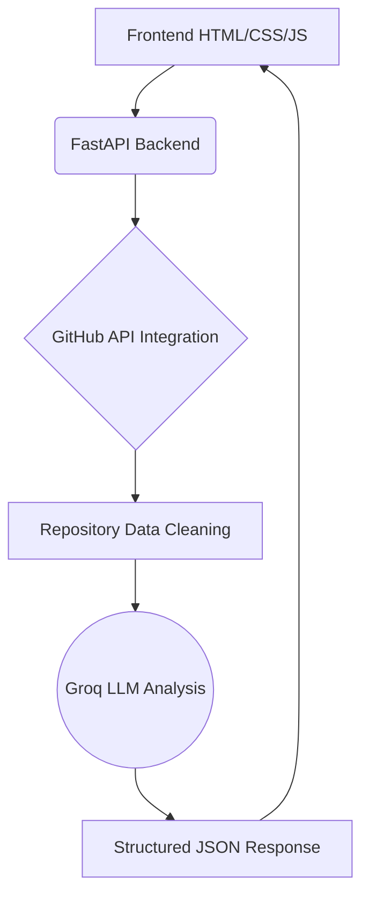

<div align="center">
  
  <h1>Smart GitHub Resume Extractor 🚀</h1>
  <p><b>An AI-powered GitHub intelligence platform that analyzes developer profiles, repositories, and job compatibility using FastAPI, GitHub API, and Groq LLMs.</b></p>

  <p>
    
    
    
    
    
    
  </p>
</div>

---

## 📌 Project Vision

The goal of this project is to build a recruiter-style AI platform capable of:
- 🔍 **Analyzing** GitHub profiles
- ✍️ **Generating** realistic developer summaries
- 📊 **Evaluating** repository quality
- 🎯 **Matching** developers against job descriptions
- 💡 **Identifying** strengths and missing skills
- 📈 **Helping** users improve their portfolios and resumes

Unlike generic AI portfolio analyzers, this platform focuses on:
- **Realistic evaluation** (No fake senior-level praise)
- **Structured outputs**
- **Recruiter-focused insights**
- **Anti-overhype prompting**

> *Because modern AI tools love calling every calculator app an "enterprise-grade scalable architecture"—which recruiters absolutely hate.*

---

## 🏗️ Current Architecture



---

## ⚙️ Tech Stack

| Domain | Technologies |
|---|---|
| **Backend** | Python, FastAPI, Uvicorn |
| **AI Layer** | Groq API, Llama 3.3 70B Versatile |
| **Frontend** | HTML, CSS, Vanilla JavaScript |
| **Integrations** | GitHub REST API |

---

## 📂 Current Project Structure

```text
smart-github-resume-extractor/
│
├── app/
│   ├── main.py
│   ├── services/
│   │     ├── github_service.py
│   │     ├── analyzer_service.py
│   │     └── ai_service.py
│
├── frontend/
│   ├── index.html
│   ├── style.css
│   └── script.js
│
├── tests/
├── .env
├── .gitignore
├── Procfile
├── railway.json
└── requirements.txt
```

---

## ✅ Features Completed

### 1. GitHub Profile Fetching
* Fetches GitHub user profiles and public repositories.
* Extracts core `README.md` data.
* **Core Functions:** `get_github_profile()`, `get_user_repositories()`, `get_readme()`

### 2. Repository Data Cleaning
* Utilizes `extract_repo_data()` to parse the raw GitHub payload.
* Extracts: Repository name, description, language, stars, and forks to use as clean AI context injection.

### 3. AI-Powered Profile Summary
* Utilizes `generate_summary()` to create realistic insights.
* **AI Generates:** Professional summary, Key skills, Company matches, Realistic resume bullet points.
* **Improvements:** Anti-overhype prompt engineering and structured JSON outputs.

### 4. Repository Deep Analysis
* Utilizes `analyze_readme()` to dive deep into project complexity.
* **Analyzes:** Repo metadata, README contents, project complexity, probable skill level.
* **Returns:** Project summary, features, tech stack, difficulty level, and resume bullets.

### 5. Job Description Matching Engine
* Utilizes `match_job_description()` to cross-reference a profile with a job description.
* **Returns:** Realistic match percentage, strengths, missing skills, and top matching repositories.

```json
{
  "match_percentage": 74,
  "strengths": [
    "FastAPI backend development",
    "Python-based ML projects"
  ],
  "missing_skills": [
    "Docker",
    "CI/CD"
  ]
}
```

### 6. Dynamic Frontend Integration
* Beautifully styled dark-theme UI with responsive design.
* Smooth API `fetch` calls dynamically rendering the DOM.
* Handles profile rendering, deep-dive repository panels, and donut-chart job-match analytics.

---

## 🛣️ API Routes

| Method | Route | Description |
|---|---|---|
| `GET` | `/` | Serves the unified frontend index.html page |
| `GET` | `/profile-summary` | Returns AI-generated developer analysis & repository list |
| `GET` | `/analyze-repo` | Returns detailed repository intelligence |
| `POST` | `/match-job` | Returns job compatibility analysis from a Pydantic payload |

---

## 🚀 Unified Production Cloud Deployment (Railway)

The application is engineered to deploy as a **single, consolidated service** on Railway. The frontend is served directly by the FastAPI backend, eliminating the friction of managing separate hosting platforms and handling cross-origin CORS settings in production.

### 🛡️ Critical Deployment Engineering & Bug Fixes

During the Railway deployment pipeline, several advanced real-world bugs were identified and fixed to ensure a completely seamless build and zero-downtime runtime environment:

#### 1. Startup Command Resolution (`railway.json` & `Procfile`)
*   **The Issue:** Railway's auto-builder (**Railpack/Nixpacks**) expects a Python entrypoint at the root `main.py`. Because our entrypoint is located at `app/main.py`, the builder failed to auto-detect a start command and aborted the build.
*   **The Fix:** Configured a modern `railway.json` and a Heroku-compatible `Procfile` at the project root to explicitly tell the container runner to boot via:
    ```bash
    uvicorn app.main:app --host 0.0.0.0 --port ${PORT:-8000}
    ```

#### 2. Startup Import-Time Crash Safeguard
*   **The Issue:** The Groq client was initialized immediately at the module level in `ai_service.py`. If `GROQ_API_KEY` was missing or unconfigured in Railway's service settings at startup, the client threw a fatal error during Python's import phase, completely crashing the Uvicorn bootloader.
*   **The Fix:** Safeguarded initialization by fallback-defaulting to a placeholder key (`os.getenv("GROQ_API_KEY") or "placeholder_key"`). The server now boots flawlessly under all circumstances, and gracefully requests API Key configuration only at the exact moment AI features are invoked.

#### 3. Consolidated FastAPI Static Serving & Mount Order
*   **The Issue:** To run as a single container, the backend was updated to mount the frontend static directory using `StaticFiles`. However, a conflicting `@app.get("/")` route on the main router was capturing root requests, preventing the homepage (`index.html`) from loading.
*   **The Fix:** Removed the conflicting root route and mounted the frontend directory with `html=True` as the final route in `app/main.py`. Specific routes match first, while general static requests successfully fall through to serve the UI.

#### 4. Async File I/O Runtime Dependency (`aiofiles`)
*   **The Issue:** FastAPI's `StaticFiles` requires `aiofiles` to handle non-blocking asynchronous file operations. Without it, the application threw a 500 error at runtime when trying to serve static CSS or JS assets.
*   **The Fix:** Appended `aiofiles` to `requirements.txt` to ensure Railway installs it automatically during the build process.

#### 5. Dynamic Origin Client Resolution
*   **The Issue:** The client was hardcoded to a static backend domain. If deployed to a different Railway subdomain or run locally, the API calls failed.
*   **The Fix:** Configured `frontend/script.js` to dynamically determine the API endpoint via `window.location.origin`, falling back gracefully to the production API if opened directly as a file.

#### 6. Bubble-Up Error Diagnostics
*   **The Issue:** Client-side fetch alerts hid the raw HTTP error payload, showing generic "Failed to fetch" alerts.
*   **The Fix:** Upgraded both backend exceptions and frontend fetch parsers to bubble up detailed system details (e.g. telling the user *exactly* how to configure `GROQ_API_KEY` in their Railway panel).

---

## 🐞 Major Bugs Fixed
- [x] Railpack/Nixpacks startup command failures (solved via `railway.json` and `Procfile`)
- [x] Module import-time startup crashes due to unconfigured API keys
- [x] Missing async I/O dependency `aiofiles` causing static serving crashes
- [x] Conflicting root route blocking static `index.html` loading
- [x] Dynamic backend URL resolution for seamless local/cloud switches
- [x] Detailed API exception bubble-ups to the frontend client UI
- [x] `.env` loading problems and Groq API key errors
- [x] Invalid JSON parsing & Broken AI responses
- [x] CORS issues and Frontend fetch failures
- [x] Local file system security errors
- [x] JavaScript silent crashes
- [x] Malformed AI output handling

---

## 🧠 Key Engineering Learnings

- **Backend:** FastAPI routing, API response handling, service-based architecture.
- **AI Engineering:** Strict Prompt engineering, structured JSON outputs, realistic AI evaluation, and LLM context injection.
- **Frontend:** Async fetch APIs, dynamic rendering, DOM manipulation, responsive CSS variables.
- **Architecture:** Modular services, clean data pipelines, and API-first application design.

> **Developer Note:** *Frontend bugs can consume more life energy than the actual AI system. A timeless law of software engineering.*

---

## 🚧 Current Status & Progress

```text
🔥 Overall Project Completion: ~65%
```
The main backend intelligence system is largely complete. Current focus is shifting towards refining the frontend experience, advanced analytics, and cloud deployment.

| Section | Status |
|---|---|
| **Backend Core** | ✅ Strong |
| **GitHub Integration** | ✅ Complete |
| **AI Integration** | ✅ Complete |
| **Job Match Engine** | ✅ Complete |
| **Frontend Logic** | ✅ Complete |
| **UI/UX Polish** | 🟡 In Progress |
| **Deployment** | ✅ Complete (Railway) |
| **Authentication** | ❌ Pending |
| **Database** | ❌ Pending |

---

## 🎯 Planned Features

### Frontend & UI
- Modern SaaS UI with recruiter dashboards.
- Charts, analytics, and dynamic loading animations.

### AI Features
- Repository ranking and skill scoring.
- Contribution graph analysis.
- AI mock interview questions and Resume PDF generation.

### Production
- Docker deployment (Render/Vercel).
- Caching & PostgreSQL database integration.
- User Authentication.

---

<div align="center">
  <p>Built with ☕ and AI | <b>Realism over Hype</b></p>
</div>
